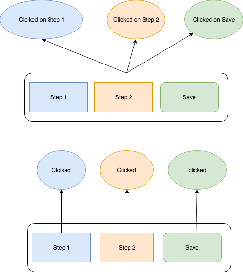

## Knowledge

### Cleanup
`disconnectedCallback` run after the component detached from a DOM (the bubbling not working, the parent element not catch the event itself).
Usually use for a cleanup.


```js
  disconnectedCallback() {}
```

### Interaction
If you wanna made interactive component, you must fire event, if something happend. You have two main option. you fire all event on your parent component and communicate what happend (like event name and detail).

```js
new CustomEvent('clicked', {
      detail: {
        label: 'step 1',
        data: { },
      }
    });

new CustomEvent('rendered');

etc.
```

or you can fire event directly the component who response that part
```js
var customEvent = new CustomEvent('trigger', {
      bubbles: true,
      detail: {
        data: { },
      }
    });
```
The second version better for a "atomic level concept"




## Exercise

- can able delete ```step``` component
- dispatch ```trigger``` event on ```step``` component if the representation in the DOM clicked


