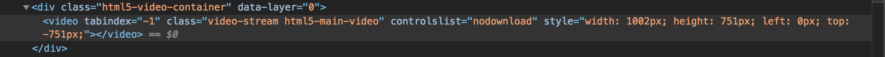
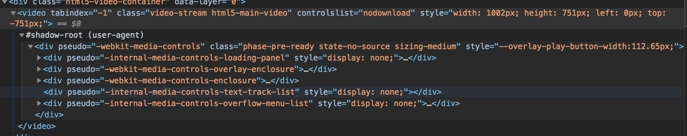

Workshop for Custom Element

1. `nvm use`
2. `npm i`
3. `npm start`

You can find the description of practice in each folder.

http://localhost:8000/

# What are web components?

> Web components are a set of web platform APIs that allow you to create new custom, reusable, encapsulated HTML tags to use in web pages and web apps. Custom components and widgets build on the Web Component standards, will work across modern browsers, and can be used with any JavaScript library or framework that works with HTML.
>
> Web components are based on existing web standards. Features to support web components are currently being added to the HTML and DOM specs, letting web developers easily extend HTML with new elements with encapsulated styling and custom behavior.

https://www.webcomponents.org/introduction

## Specification

### Shadow DOM
Encapsulate the style and markup.

developer tools -> Settigs -> Show user agent shadow DOM

### HTML Template
Declare fragments of markup that go unused at page load, but can be instantiated later on at runtime.

### ES Modules
The specification defines the inclusion and reuse of JS documents in a standards based, modular, performant way.

### Custom Elements
Designing and using new types of DOM elements.
